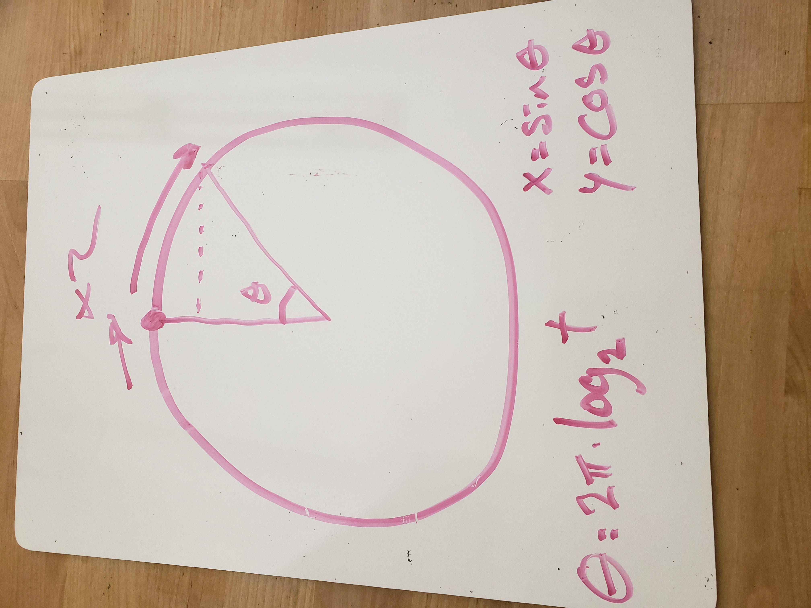
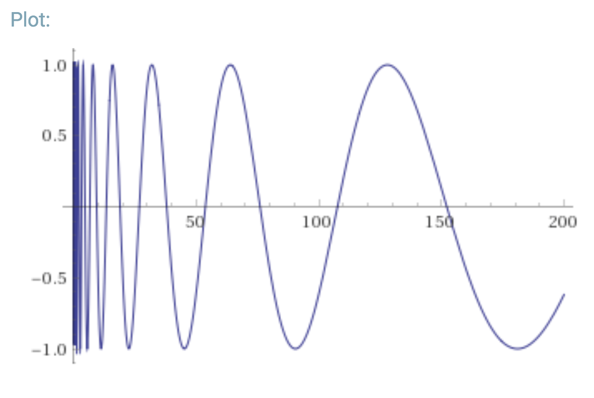
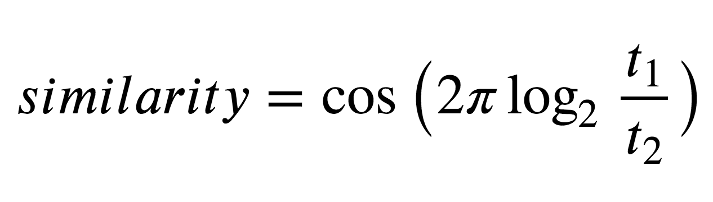

# Feature Engineering

### Scalar variables taken straight from analysis:
  - Acousticness
  - Danceability
  - Energy
  - Instrumentalness
  - Liveness
  - Loudness
  - Speechiness
  - Valence

### The hard part:
  - Mode
    - Use dummy variables for input, as interactions with other terms are important
    - Not in output layer, but used with key to determine harmonic/consonant transitions
  - Key
    - Use research in computational musicology for output matching (along with mode)
  - Tempo
    - Do not use for input or output of RNN
    - similarity metric is explained below

## Tempo
One of the hardest questions in this project was how to use tempo.  Surely it's an important feature, but how to treat it mathematically was not apparent at first.  I took an approach which expands tempo to two dimensions so that a similarity metric can be calculated as the distance between points. A circle is used to caputre the cyclical nature of tempo similarity.

Here's just the _x_ component graphed against the input (tempo):

A simplified similarity sccore is given by:

<a href = "https://www.wolframalpha.com/input/?i=cos(2pi*log2(a)-2pi*log2(b)))+in+range(30,200)">Wolfram Alpha</a>
