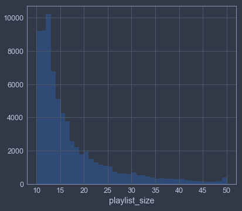
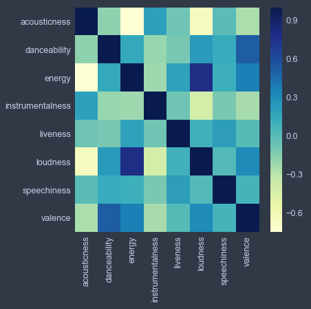
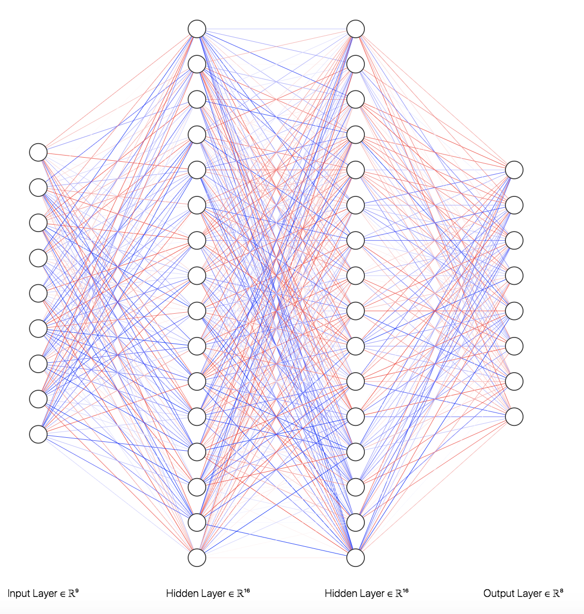
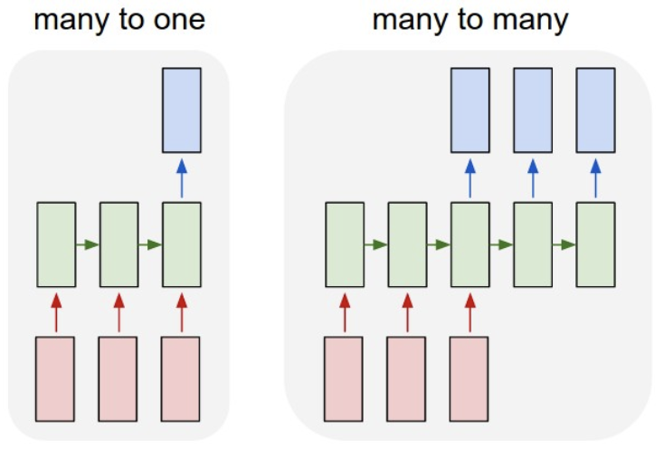

# The Best Playlists are More than a Collection of Songs
Have you ever made a playlist or mixtape and are stuck on the order to put the songs in?  Maybe we can learn from different spotify users what makes a good playlist.
The best playlists have a good flow.  This is what separates a good DJ from a bad DJ, given they have the same tracks and technical aptitude.  Build-ups and break-downs make for an interesting experience, and it’s more than just picking the most similar song to the last one.

### The Solution
_Deep Sequential Content Optimization_ or "DISCO"
- Ordered recommendations using recurrent nerual networks.
- The main focus of this project is a content-based algorithm that would sit on top of a layer of collaborative filtering.

### Key Concepts
- Recommendation Systems
- Sequence Learning
- Recurrent Neural Networks
- Computational Music Theory

 ### Tech
 - Spotify API
 - Keras
 - Plotly

## Table of Contents - Highlights
- pipeline.ipynb - This is the algorithm in action with a full pipeline of transformations and predictions to build playlists.
- /cloud/model.ipynb - RNN trained on Amazon SageMaker
- /data-wrangling/preprocessing.ipynb - the majority of data preprocessing and EDA is here.  This is also where PCA and scalers are trained.

## The Algorithm
1. A sub-set of songs is selected using collaborative filtering or a simple query based on subgenre.  I'm using Spotify's Api to select roughly 200-400 songs.
2. A recurrent neural network determines the ideal feature vector for the next song based on the previous sequence of songs.
3. The next song is selected based on minimum loss from the sub-set selected in step 1.  The loss function is determined based on the distance from a song to the ideal feature vector as well as the consonance of song key transition and similarity of tempo. This is a greedy algorithm which does not consider whether the song might better fulfill the objective function better later in the sequence.
4. Next song is plugged into the RNN and the process repeats from step 2 until the playlist is a satisfactory length.

---
## The Data
- Inital Data...
  - 15,918 users
  - 157,504 playlists
  - 2,032,044 songs
- The data used
  - Very large and very small playlists removed
  - Things like “liked from radio” dropped
- Used that to build search strings and hit spotify’s API for like literally a week straight
- Training Data for RNN is a 72051 x 50 x 9 tensor

## Features
_Metadata from Spotify "Features" API_

Concrete Features
- Key
- Mode
- Tempo
“Abstract” Features
- Acousticness
- Danceability
- Energy
- Instrumentalness
- Liveness
- Loudness
- Speechiness
- Valence

---
# Recurrent Neural Network
A recurrent neural network is different from other deep learning architectures because it learns sequences rather than a single set of values.  While RNN applications in recommendation systems typically involve one-hot encoding for the next item in a sequence, I've employed RNNs for multivariate time series forecasting of the different "abstract features" which describe the character of songs in a playlist.  The RNN architecture is 9 inputs, 8 outputs, with two 16-node hidden layers.  8 input/output nodes correspond to the 8 "abstract features," and one additional one is used in the input layer for mode. (More on this later.) The model's mean absolute error is 0.5848 and the mean absolute deviation in the training data is 0.8535.

The model uses a many-to-many sequence learning format, and in its implementation is used as many-to-one, where the output is not fed back into the input (without some modification... more on that in the next section).  At each step of the RNN, the whole computation graph (above) is used.

Standard Scaler and Yeo-Johnson Power Transformation applied to training set with duplicates removed, to give the data better distributions both for training as well as distance metrics.  Furthermore, some features, especially "Loudness," benefit from reducing the extreme long tails.

Although Euclidian distance is ideal for model implementation, MSE often leads to under-estimation of weights and biases as gradients lead to local minima near zero, as outliers are heavily penalized.  This is why MAE is used as an objective function instead.

Linear activations were used in all layers as they are less likely to under-estimate features and produce a higher-variance model.  Weights are initialized randomly, and Adam optimizer was used instead of RMSProp, though the latter is more common for RNNs.  The logic gates of GRU and LSTM are not necessary as long-term dependency is not a major concern.

---

# Selecting the Next Song
Three parameters are used to pick the best next song

## 1. Distance to RNN output vector
As mentioned above, _mode_ is not part of the output vector because first, it's used insteead with key to determine key transition consonance, and second, because I didn't want errors to backpropagate. Two tuning parameters are associated with this distance metric:
- Flow: how much to count distance in the overall _argmin_ that determines the next song to pick
- Spicyness: a scaler for the RNN output, since parameters are often underestimated

## 2. Key Similarity
The circle of fifths is the backbone of this part of the algorithm.  Distance in the circle of fifths determines how close two keys are in both a sonic and simple mathematical sense, so the number of steps is the basis for this part of the loss function for a song.

## 3. Tempo Similarity

---
# Everything together in action

---
## Next Steps
- 
- 

## Research
- Sequence-Aware Recommender Systems: https://arxiv.org/pdf/1802.08452.pdf
- RNNs: http://karpathy.github.io/2015/05/21/rnn-effectiveness/

 

